# PAO – PowerOfThree

It started with three people, less than one month, and one big idea:  
to bring together **Bare Metal, Embedded Linux, and Android Automotive** into a single connected system.

This project is the harvest of 9 months at the ITI Embedded Systems Track.  
That’s how **PAO – The Power of Three** was born.

- **The Power of Three People**: Patrick Atef, Abdallah, and Omar.  
- **The Power of Three Systems**: Bare Metal + Yocto + AOSP.  

Together, we designed, coded, and integrated everything end-to-end into a **Tri-System Embedded Architecture** that bridges microcontrollers, embedded Linux, and Android Automotive into a secure, intelligent automotive platform.

---

##  System Architecture

### 1. Bare Metal Microcontrollers
- **ESP32** → Secure fingerprint enrollment & authentication (SHA hashing).  
- **STM32 Bluepill** → Reads potentiometers & push buttons, transmits real-time data via CAN.  

### 2. Embedded Linux (Yocto on Raspberry Pi 3B+)
- Custom **Yocto layer (meta-pao)** with integrated **vsomeip**.  
- **Qt6 cluster UI** shows STM32 sensor data (CAN) & ESP32 fingerprint events (UART).  
- **systemd services** auto-launch the Qt6 app at startup.  
- Acts as the **central bridge node** between Bare Metal and Android Automotive.  

### 3. AOSP (Android Automotive on Raspberry Pi 5 – 16 GB RAM)
- Customized **AOSP 15** build with direct **VHAL integration**.  
- **vsomeip inside VHAL** → event-driven communication with Yocto.  
- **Kotlin Passenger App** with:  
  - HVAC multi-zone control  
  - Ambient lighting zones  
  - Media & music playback  
  - Voice assistant (Vosk)  
  - GPS navigation  
  - Secure OTA updates (SHA verification)  
  - Child Mode → multi-user profiles via OpenCV face detection  

---

##  Key Innovations
- **End-to-End Security** → Fingerprint & OTA updates protected with SHA hashing.  
- **vsomeip in Yocto & Android VHAL** → Event-driven communication across systems.  
- **meta-pao Yocto Layer** → Customized integration layer with automation (systemd).  
- **Qt6 Cluster UI** → Real-time visualization of CAN data.  
- **Immersive Android Automotive Passenger App** → Multi-zone HVAC, lighting, music, GPS & voice.  

---

## 📸 Cluster (Yocto) Display Screenshots

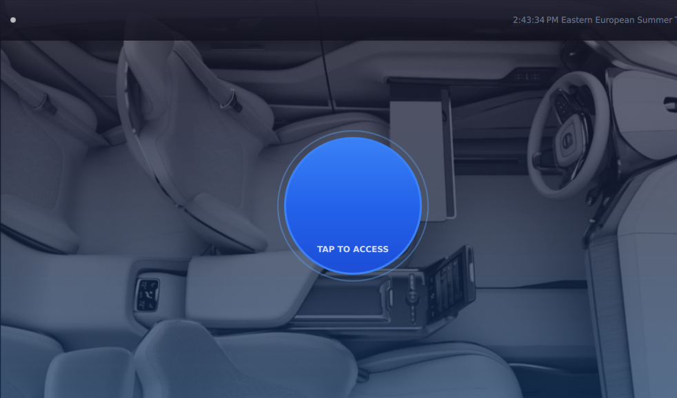
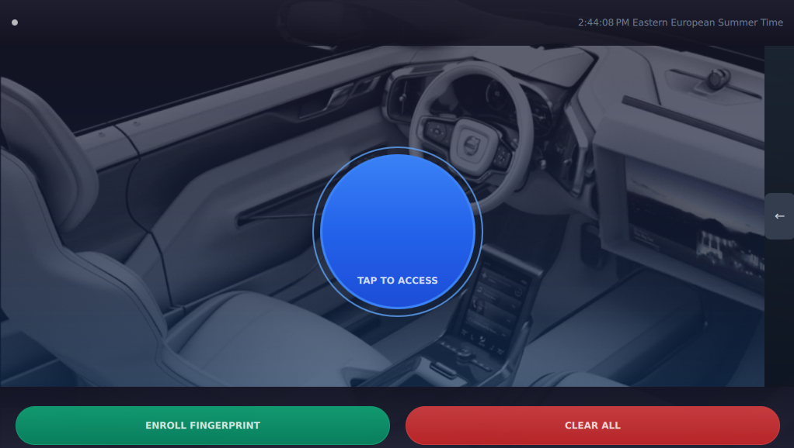
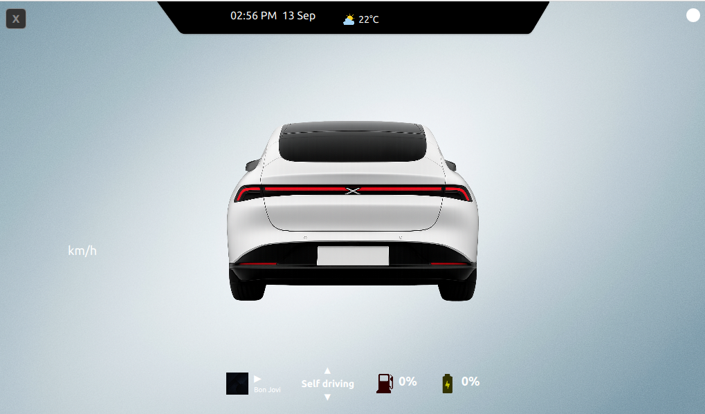

---

## The Secondary Display

## 📸 Passenger (AOSP) Display Screenshots

### Fingerprint
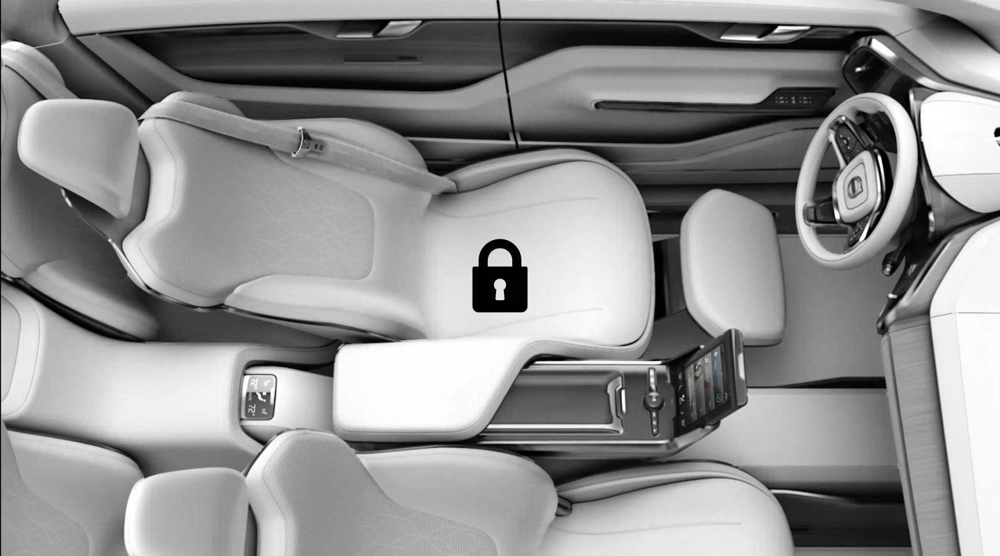

### Main Dashboard
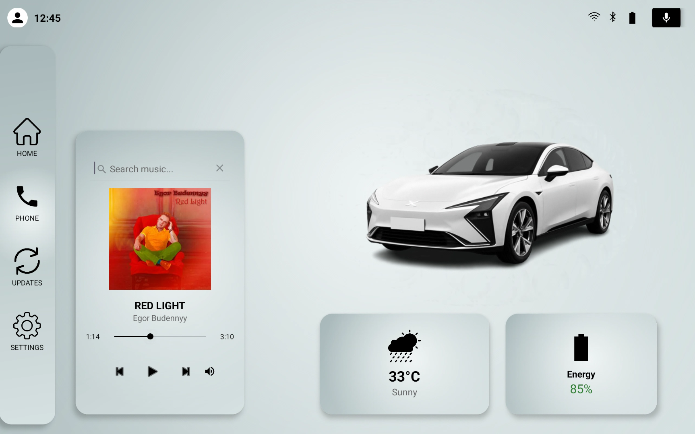
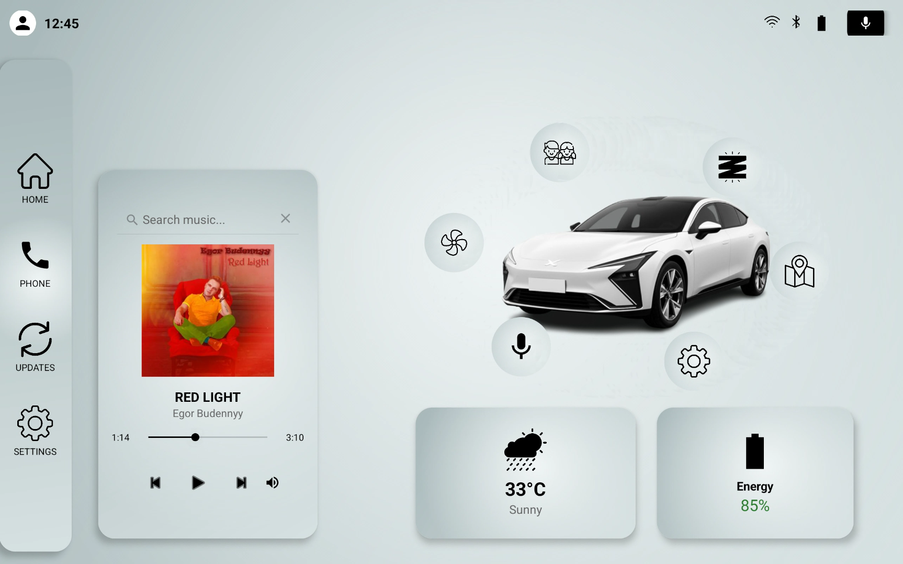

### Ambient Lighting
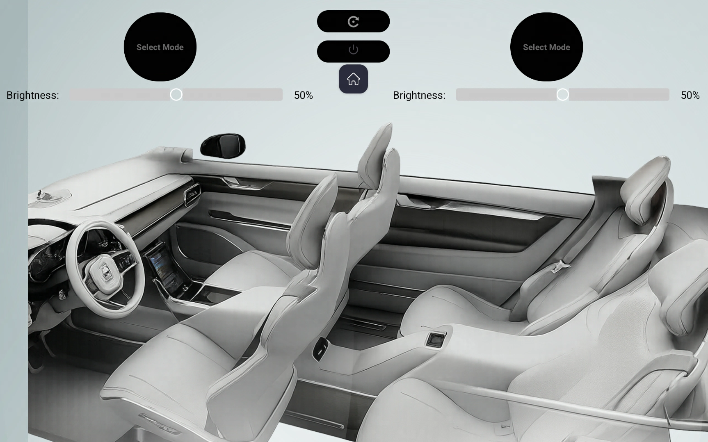
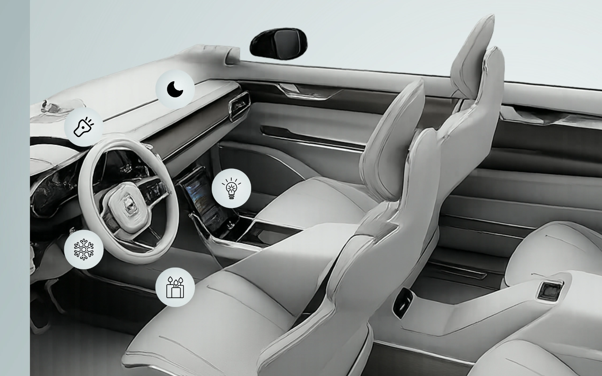
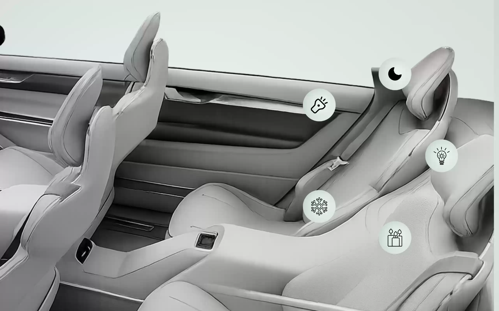

### HVAC Control
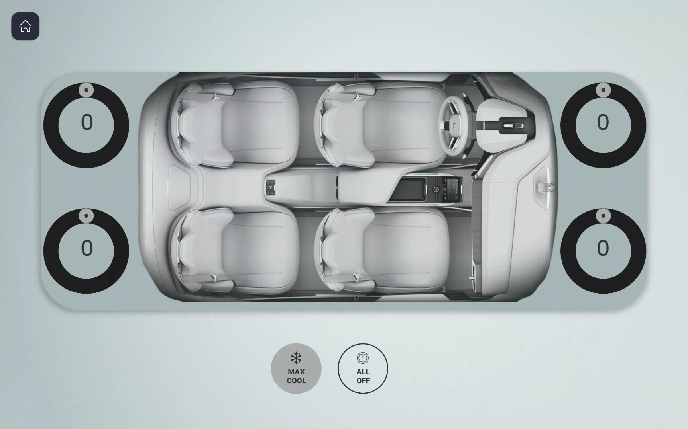
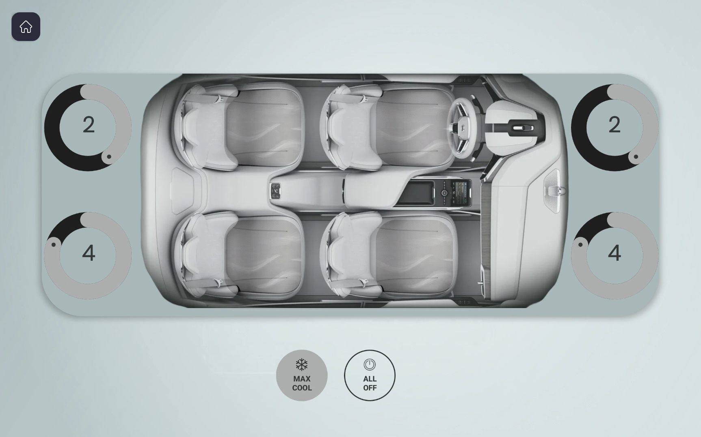
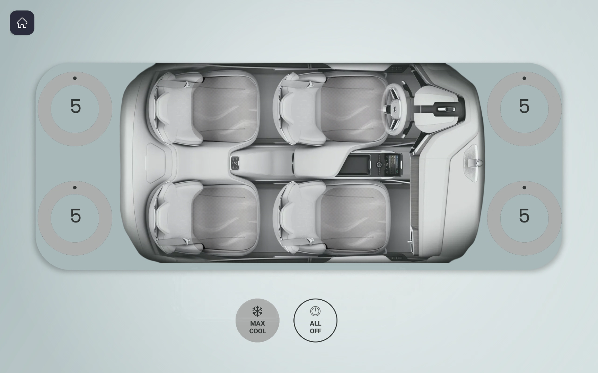

### Navigation
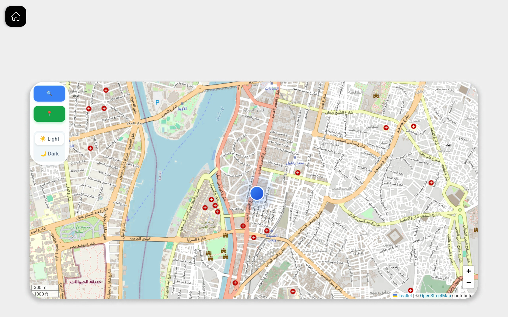
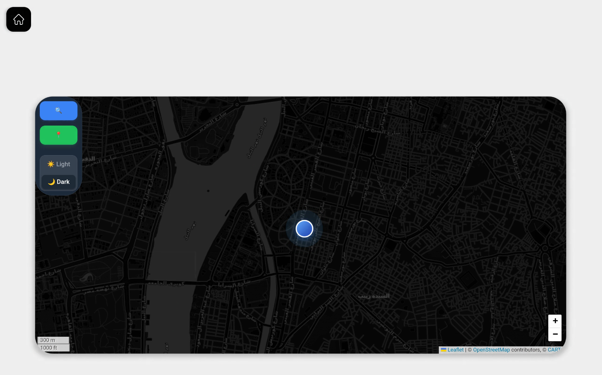
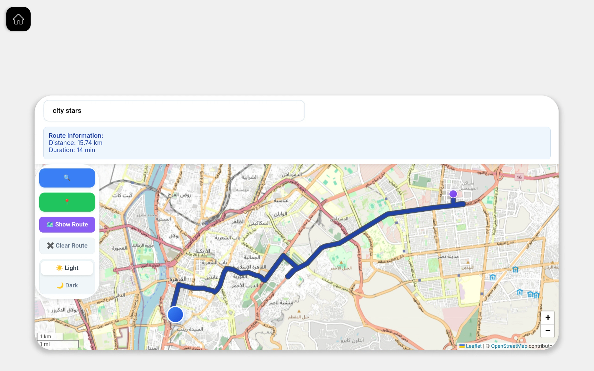

### Voice Recognition
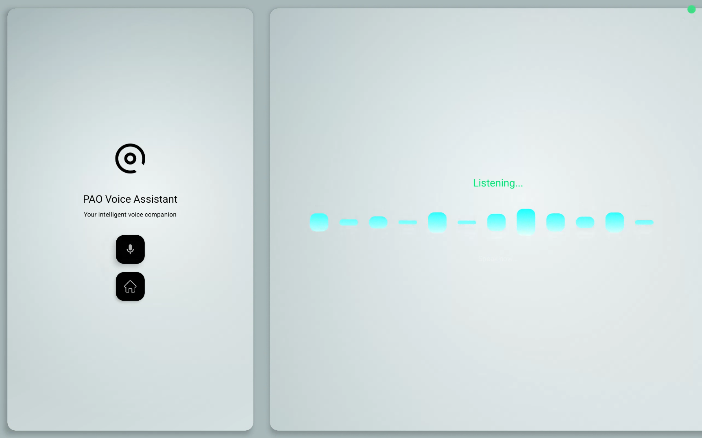

---

## 🎥 Demo Video

Click the image above to watch the demo video on Google Drive.

---

## Repositories

Our ecosystem is split into multiple repos:

- [**AOSP**](https://github.com/PAO-PowerOfThree/AOSP) → Platform customization, VHAL, Kotlin passenger app.  
- [**Qt**](https://github.com/PAO-PowerOfThree/Qt) → Cluster display with Qt6 & QML.  
- [**Bare-Metal**](https://github.com/PAO-PowerOfThree/Bare-Metal) → STM32 & ESP32 drivers and secure fingerprint.  
- [**Yocto**](https://github.com/PAO-PowerOfThree/Yocto) → Custom meta-pao layer with vsomeip and Qt integration.  
- [**OTA**](https://github.com/PAO-PowerOfThree/OTA) → Secure update mechanism with SHA verification.  
- [**Security**](https://github.com/PAO-PowerOfThree/Security) → Cryptography & communication security.  
- [**vsomeip**](https://github.com/PAO-PowerOfThree/vsomeip) → Middleware for client/server communication.  
- [**.github**](https://github.com/PAO-PowerOfThree/.github) → Org-wide configs and workflows.  

---

##  Vision

Three people.  
Three systems.  
One connected automotive platform.  

This is **PAO – PowerOfThree**.  
